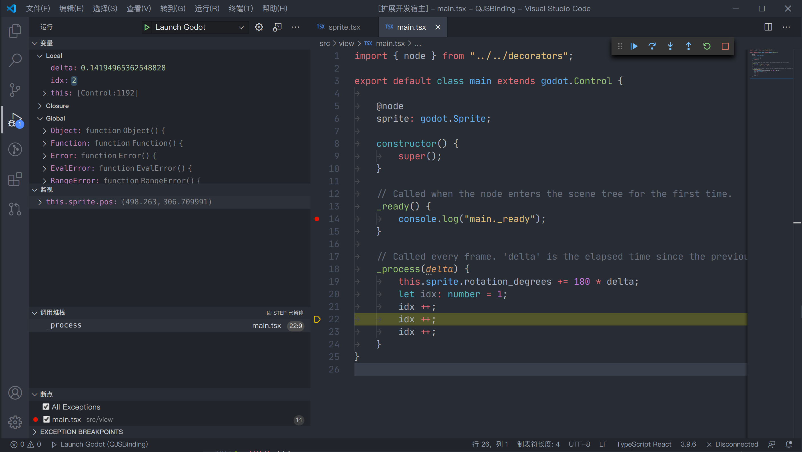

# Godot JavaScript Debug for VS Code

This is a VSCode debug adapter for [Godot JavaScript binding](https://bellard.org/quickjs/).

Godot Debugger supports
- Pause
- Continue
- Step over
- Step into
- Step out
- Evaluation in debugger console and watch panel
- Inspect global namespace
- Closer variable access
- SourceMap of TypeScript

## Using Godot Debug

* Specify the `godot` executeble path in `.vscode/launch.json`.
* Switch to the debug viewlet and press the gear dropdown.
* Select the debug environment "Launch Godot".
* Press the green 'play' button to start debugging.

You can now step through your javascript files, set and hit breakpoints.

### Thanks for contributors
This plugin is forked from [koush's QuickJS debugger](https://github.com/koush/vscode-quickjs-debug). Thanks for your great work for the QuickJS debugger protocal !